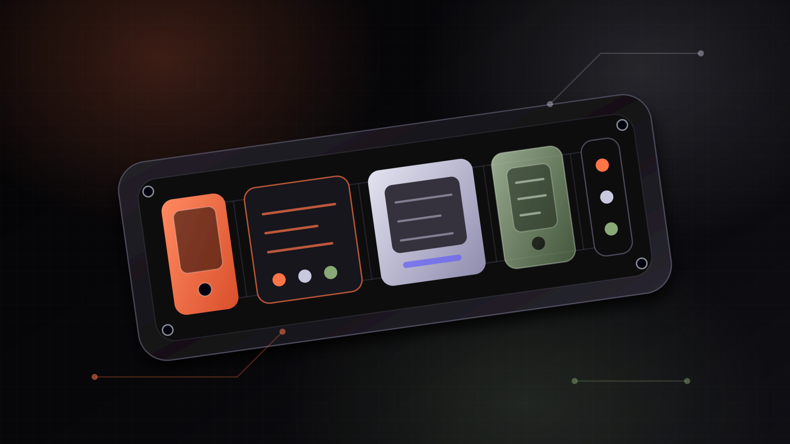

# Framework 13 Pro for Omarchy



An unofficial Omarchy 4 theme inspired by the Framework Laptop 13 Pro's
graphite chassis, orange and lavender keyboard colorways, and translucent green
bezel.

> [!IMPORTANT]
> This is an independent fan project. It is not affiliated with, endorsed by,
> sponsored by, or authorized by Framework Computer Inc. The maintainer is a
> former Framework employee; that prior employment does not imply any current
> relationship, representation, authorization, or endorsement.

## Install

Install from the Omarchy menu under **Install > Style > Theme**, or run:

```bash
omarchy theme install https://github.com/ctl0v0/omarchy-framework-13-pro-theme
```

The repository name follows Omarchy's naming convention, so the installed
theme appears as `Framework 13 Pro`.

## Included

- Complete semantic and ANSI palette in `colors.toml`
- Orange-to-lavender active window border
- Translucent Omarchy bar, menu, popup, notification, lock, and policy surfaces
- Portable `Yaru-purple` file-manager icon selection
- Original dark modular wallpaper and matching theme preview

Omarchy generates configurations for supported terminals, editors, browsers,
Hyprland, and shell components from `colors.toml` when the theme is activated.

The ANSI yellow slot intentionally uses translucent-bezel green, while the ANSI
green slot uses keyboard lavender. This preserves the product-inspired palette
but differs from conventional terminal color naming.

## Official Framework Wallpapers

Framework publishes wallpaper packs at
[frame.work/wallpapers](https://frame.work/wallpapers). They are not bundled
here because the downloads do not include an explicit redistribution license.

After downloading your preferred images, place them in:

```text
~/.config/omarchy/backgrounds/framework-13-pro/
```

They will be available alongside the included background the next time the
theme is selected. Recommended matches include `FW 13 Wallpaper Dark.jpg`,
`FW 13 Wallpaper Light.jpg`, `FW 13 Pro Wallpaper 7.png`, and
`FW 16 Wallpaper 6.png`.

## Optional Personalization

Window rounding is intentionally not installed by this theme. Omarchy treats
Hyprland Lua as executable configuration and removes it from remotely installed
themes. Set your preferred rounding in `~/.config/hypr/looknfeel.lua`; an 8 px
circular radius works well with the shell surfaces.

The local development version uses custom lavender-and-orange folder icons and
a branded unlock image. They are not distributed here because external icon
themes cannot be installed portably by an Omarchy theme and Framework artwork
is not included without redistribution permission.

## Compatibility

Developed and tested on Omarchy 4. Remote installation relies on the current
`colors.toml` theme generation and `shell.<section>.toml` override behavior.

## License And Trademarks

Original configuration and artwork in this repository are available under the
[MIT License](LICENSE). See [NOTICE.md](NOTICE.md) for trademark, affiliation,
and asset details.
