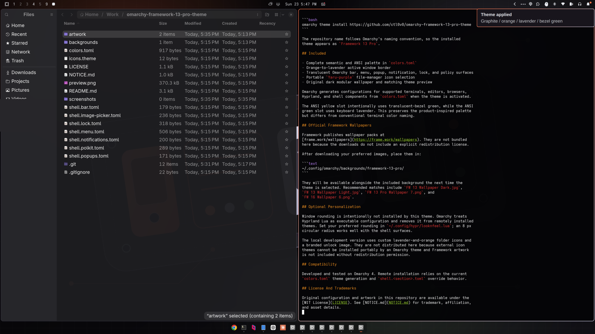

# Framework 13 Pro for Omarchy


An unofficial Omarchy 4 theme inspired by the Framework Laptop 13 Pro's
graphite chassis, orange and lavender keyboard colorways, and translucent green
bezel.

> [!IMPORTANT]
> This is an independent fan project. It is not affiliated with, endorsed by,
> sponsored by, or authorized by Framework Computer Inc. The maintainer is a
> former Framework employee; that prior employment does not imply any current
> relationship, representation, authorization, or endorsement.

## Install

Install from the Omarchy menu under **Install > Style > Theme**, or run:

```bash
omarchy theme install https://github.com/ctl0v0/omarchy-framework-13-pro-theme
```

The repository name follows Omarchy's naming convention, so the installed
theme appears as `Framework 13 Pro`.

## Included

- Complete semantic and ANSI palette in `colors.toml`
- Orange-to-lavender active window border
- Translucent Omarchy bar, menu, popup, notification, lock, and policy surfaces
- Portable `Yaru-purple` file-manager icon selection
- Original dark modular wallpaper, three official Framework wallpapers, and a
  real desktop preview
- Framework-orange password-field focus styling for the Omarchy lock screen

Omarchy generates configurations for supported terminals, editors, browsers,
Hyprland, and shell components from `colors.toml` when the theme is activated.

The ANSI yellow slot intentionally uses translucent-bezel green, while the ANSI
green slot uses keyboard lavender. This preserves the product-inspired palette
but differs from conventional terminal color naming.

## Screenshots

The main preview shows the generated terminal palette, Neovim colors, active
window border, translucent surfaces, and included wallpaper on Omarchy 4.



## Included Framework Wallpapers

The theme includes three images from Framework's official Laptop 13 Pro
wallpaper pack. Because they live in `backgrounds/`, Omarchy installs them with
the theme and makes them available in the background picker automatically.

| Included file | Original file | Theme fit |
| --- | --- | --- |
| `00-framework-gear-dark.png` | `FW 13 Pro Wallpaper 7.png` | Black code gear with orange details |
| `04-framework-orange.png` | `FW 13 Pro Wallpaper 4.png` | Orange terminal artwork |
| `06-framework-graphite.png` | `FW 13 Pro Wallpaper 6.png` | Black floating gear and terminal hand |

The source pack is available from
[Framework's wallpaper page](https://frame.work/wallpapers) or as the direct
[Laptop 13 Pro wallpaper pack](https://downloads.frame.work/assets/framework-laptop13pro-wallpaper-pack.zip).

Framework publishes several other wallpaper packs that also pair well with the
theme:

| Wallpaper | Official download | Theme fit |
| --- | --- | --- |
| `FW 13 Wallpaper Dark.jpg` | [Laptop 13 pack](https://downloads.frame.work/assets/framework-laptop13-wallpaper-pack.zip) | Dark, nature-like purple and graphite dunes |
| `FW 13 Wallpaper Light.jpg` | [Laptop 13 pack](https://downloads.frame.work/assets/framework-laptop13-wallpaper-pack.zip) | Orange and lavender daylight dunes |
| `FW 16 Wallpaper 6.png` | [Laptop 16 pack](https://downloads.frame.work/assets/framework-laptop16-wallpaper-pack.zip) | Charcoal technical laptop drawing |
| `FW12 Wallpaper Black.png` | [Legacy pack](https://downloads.frame.work/assets/framework-wallpaper-legacy-pack.zip) | Black hardware with orange accents |

After downloading your preferred images, place them in:

```text
~/.config/omarchy/backgrounds/framework-13-pro/
```

They will be available alongside the bundled backgrounds the next time the
theme is selected.

## Optional Personalization

Window rounding is intentionally not installed by this theme. Omarchy treats
Hyprland Lua as executable configuration and removes it from remotely installed
themes. Set your preferred rounding in `~/.config/hypr/looknfeel.lua`; an 8 px
circular radius works well with the shell surfaces.

The local development version uses custom lavender-and-orange folder icons and
a branded unlock image. They are not distributed here because external icon
themes cannot be installed portably by an Omarchy theme, and the branded
unlock image is not part of Framework's published wallpaper pack.

## Optional Animated Login Screen

The repository includes a native Qt/QML SDDM greeter under `extras/sddm/`.
It reproduces the Aurora motion with the theme palette and an original modular
center mark; the greeter itself does not embed Framework logos or wallpapers.

SDDM is system-level configuration, so Omarchy deliberately does not install
this add-on as part of `omarchy theme install` or `omarchy theme update`.
Install or refresh it explicitly from a terminal:

```bash
sudo ~/.config/omarchy/themes/framework-13-pro/extras/sddm/install
```

The installer does not restart SDDM or end the active desktop session. The
updated greeter appears after the next logout or reboot. After a future
`omarchy theme update`, rerun the command above to copy the refreshed QML into
SDDM's system theme directory.

The lock-screen color remains a normal Omarchy theme update; only the animated
login greeter needs this extra installation step.

## Compatibility

Developed and tested on Omarchy 4. Remote installation relies on the current
`colors.toml` theme generation and `shell.<section>.toml` override behavior.

## License And Trademarks

Original configuration and artwork in this repository are available under the
[MIT License](LICENSE). See [NOTICE.md](NOTICE.md) for trademark, affiliation,
and asset details.
